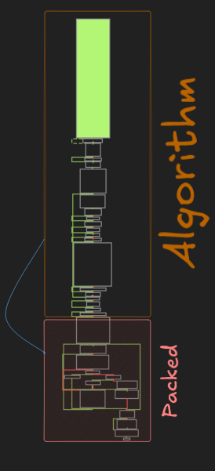

### Приветствую всех. Данная статья посвящена моему небольшому ресерчу протектора прошлых лет ACProtect. В рамках материала я разберу несколько ключевых механизмов его работы

#### Основная логика защиты базируется в секции `.perplex`. По завершении всех процедур протектор осуществляет переход в секцию `.text`, передавая управление оригинальному коду программы

### Механизмы 
- [x] Obfuscation
  - [x] Instruction imecration  
  - [x] DeadCode
- [x] API Rediraction
- [x] Self Modifying Code


### Obfuscation

#### В ранних версиях протектора ключевые механизмы обфускации базировались на использовании `DeadCode` и `Instruction Imbrication`

- Паттерн на Instruction Imbrication можно описать таким образом
```
  if(operand_address == (next_address + 1))
  {
    DETECT Instruction Imbrication
  }
```


#### Пример
```
Instruction Imbrication

0046B001          | 72 03                      | jb unpackme_acprotect1.32.c1.46B006                       |
0046B003          | 73 01                      | jae unpackme_acprotect1.32.c1.46B006                      |
0046B005          | 7B 7C                      | jnp unpackme_acprotect1.32.c1.46B083                      |

OR

0046B00F          | E8 01000000                | call unpackme_acprotect1.32.c1.46B015                     |
0046B014          | EB 83                      | jmp unpackme_acprotect1.32.c1.46AF99                      |
```

#### О DeadCode сказать нечего, ниже приведены примеры
#### Пример
```
0046B00C          | FC                         | cld                                                       |
0046B00D          | FC                         | cld                                                       |

0046B0A3          | B8 2ADC7A20                | mov eax,207ADC2A                                          |
0046B0AD          | 81F0 7183F41E              | xor eax,1EF48371                                          |


0046B0F7          | 52                         | push edx                                                  | edx:EntryPoint
0046B0F8          | 8F05 E5BE4600              | pop dword ptr ds:[46BEE5]                                 |

```


### API Rediraction
#### API Rediraction - Механизм работает по следующему принципу: реальные адреса системных функций скрыты. Протектор выполняет операцию XOR с константами, восстанавливая валидный адрес в памяти прямо во время исполнения, после чего происходит переход  API функцию


#### Пример
```
004271D6          | FF15 DC0A4600              | call dword ptr ds:[460ADC]                                |
                  
0046B4A2          | 68 70C4E471                | push 71E4C470                                             |
0046B4A7          | 813424 90E26F04            | xor dword ptr ss:[esp],46FE290                            |
0046B4AE          | C3                         | ret                                                       |

```

### Self Modifying Code

#### Self Modifying Code - В отличие от простых упаковщиков, которые расшифровывают код один раз перед запуском, ACProtect активно использует механизмы самомодификации на всех этапах своей работы. Код протектора постоянно мутирует 


#### Алгоритм
```cpp
while(block_size)
{
    ecx = ds[ebx];
    xor ecx, eax

    ror eax, 0x17
    add ebx, 0xFFFFFFFC
    sub ecx ds[ebx] // current_instructino - next_instruction
    mov dword ds[ebx - 0x4], ecx
    sub ebx, 0xFFFFFFFC
    
    block_size--;
}

```

#### Пример




## Примечание: На момент написания статьи реализованы только механизмы для снятия обфускации
#### Инструмент для снятия [ACProtect](https://github.com/icryft17/lim-deobfuscator)


---------------------------------------------------------------------- 


### Hello everyone. This article is dedicated to my small research of the ACProtect protector from past years. In this material, I will go over several key mechanisms of how it works.


#### The main protection logic is based in the `.perplex` section. After completing all procedures, the protector transfers execution to the `.text` section, passing control to the program’s original code.

### Mechanisms
- [x] Obfuscation
  - [x] Instruction Imbrication  
  - [x] DeadCode
- [x] API Redirection
- [x] Self Modifying Code


### Obfuscation

#### In early versions of the protector, the key obfuscation mechanisms were based on the use of `DeadCode` and `Instruction Imbrication`

- The pattern for Instruction Imbrication can be described as follows
```
  if(operand_address == (next_address + 1))
  {
    DETECT Instruction Imbrication
  }
```
##### Example
Instruction Imbrication
```
0046B001          | 72 03                      | jb unpackme_acprotect1.32.c1.46B006                       |
0046B003          | 73 01                      | jae unpackme_acprotect1.32.c1.46B006                      |
0046B005          | 7B 7C                      | jnp unpackme_acprotect1.32.c1.46B083                      |

OR

0046B00F          | E8 01000000                | call unpackme_acprotect1.32.c1.46B015                     |
0046B014          | EB 83                      | jmp unpackme_acprotect1.32.c1.46AF99                      |
```

#### There is nothing special to say about `DeadCode`, examples are shown below
#### Example
```
0046B00C          | FC                         | cld                                                       |
0046B00D          | FC                         | cld                                                       |

0046B0A3          | B8 2ADC7A20                | mov eax,207ADC2A                                          |
0046B0AD          | 81F0 7183F41E              | xor eax,1EF48371                                          |


0046B0F7          | 52                         | push edx                                                  | edx:EntryPoint
0046B0F8          | 8F05 E5BE4600              | pop dword ptr ds:[46BEE5]                                 |

```


### API Redirection
#### API Redirection - This mechanism works as follows: the real addresses of system functions are hidden. The protector performs an XOR operation with constants, restoring the valid address in memory at runtime, after which execution is transferred to the API function.


#### Example
```
004271D6          | FF15 DC0A4600              | call dword ptr ds:[460ADC]                                |
                  
0046B4A2          | 68 70C4E471                | push 71E4C470                                             |
0046B4A7          | 813424 90E26F04            | xor dword ptr ss:[esp],46FE290                            |
0046B4AE          | C3                         | ret                                                       |

```

### Self Modifying Code

#### Self Modifying Code - Unlike simple packers that decrypt code once before execution, ACProtect actively uses self-modification mechanisms at all stages of its operation. The protector’s code constantly mutates.


#### Algorithm
```cpp
while(block_size)
{
    ecx = ds[ebx];
    xor ecx, eax

    ror eax, 0x17
    add ebx, 0xFFFFFFFC
    sub ecx ds[ebx] // current_instruction - next_instruction
    mov dword ds[ebx - 0x4], ecx
    sub ebx, 0xFFFFFFFC
    
    block_size--;
}
```


#### Example


#### Note: At the time of writing, only deobfuscation mechanisms have been implemented
#### Tool for removing [ACProtect](https://github.com/icryft17/lim-deobfuscator)
